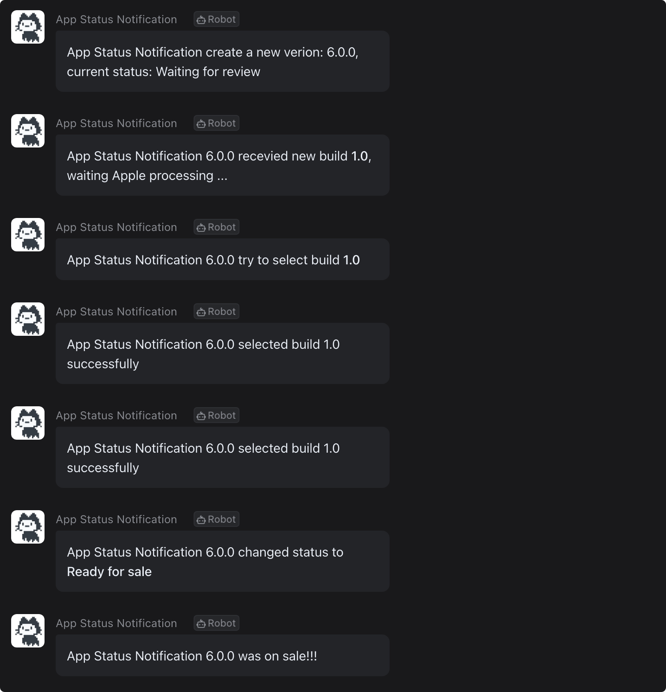

# App Status Notification

🎉 Quick deliver your app(s) review status with your team for mostly platforms like Slack, Dingtalk, WeChat work etc

## Features

- Using App Store Connect official API.
- Support multi-account from appstoreconnect.
- Support multi-application (iOS, macOS).
- Select the latest build automatically.
- Share status intormfation to mostly services: Slack, Dingtalk, Wecom (Wechat work), Feishu (Lark), more is coming.
- Localization support (English, Simplified Chinese).
- Easy deploy with Docker.

## Preview



## Configuration

View example config file in [config/notification.yml](config/notification.yml)

## Deploy

### Docker

Install docker and docker-compose first.

```bash
$ git clone https://github.com/icyleaf/app_status_notification.git
$ docker-compose up
```

### Complie

Install ruby and bundler first.

```bash
$ git clone https://github.com/icyleaf/app_status_notification.git
$ bundle install
$ rake install
$ app_status_notifcation --help
```

## CLI

```
NAME
    app_status_notification - Manage iOS app status notification


SYNOPSIS
    app_status_notification [global options] command [command options] [arguments...]


VERSION
    0.12.0


GLOBAL OPTIONS
    -c, --config=config    - Set config path (and custom locales) (default: none)
    -d, --[no-]development - Enable development mode (use .local.yml config)
    --help                 - Show this message
    --log-level=value      - Set log level (default: info)
    -s, --store=store      - Set store path (default: none)
    --version              - Display the program version


COMMANDS
    help  - Shows a list of commands or help for one command
    test  - Test config struct and send test message via webhook(s)
    watch - Start watch service
```

## Many Thanks

- [spaceship](https://github.com/fastlane/fastlane/tree/master/spaceship) from fastlane
